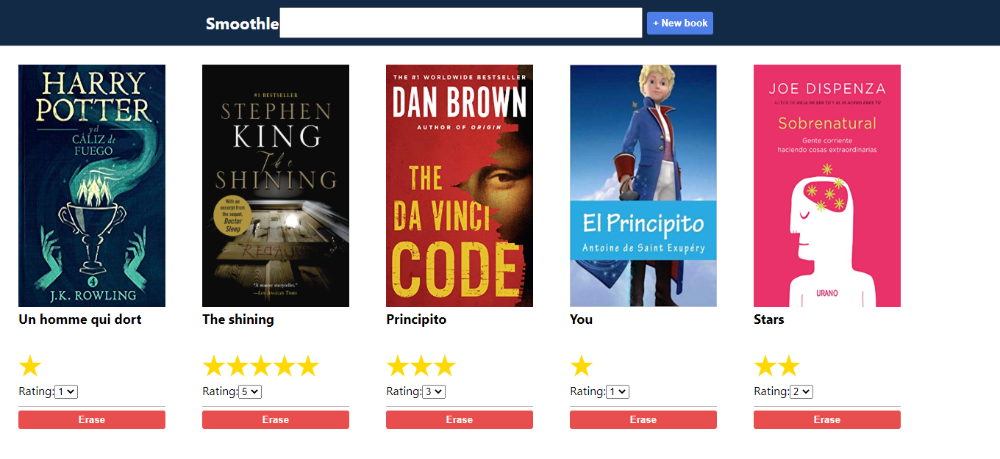

# ✨ smoothle

## 📝 Table of Contents

* [About the Project](#about-the-project)
* [Available Scripts](#available-scripts)
* [Built With](#built-with)
* [Contact](#contact)
* [Acknowledgements](#acknowledgements)

<!-- ABOUT THE PROJECT -->
## 👉 About The Project

This project was completely built with [Create React App](https://github.com/facebook/create-react-app).
You can add/erase items, in this case books, and display them on the screen. 

## Available Scripts

In the project directory, you can run:

### `npm start`

Runs the app in the development mode. 
Open [http://localhost:3000](http://localhost:3000) to view it in the browser.

The page will reload if you make edits. 
You will also see any lint errors in the console.

### 🛠 Built With

*   React.js 
*   ES6
*   npm

<!-- CONTACT & SUPPORT -->
## Contact & Support

🙍 Guadalupe Rangel - kanemekanik@gmail.com - ☄

You liked it? ⭐️ Star the project!!!
